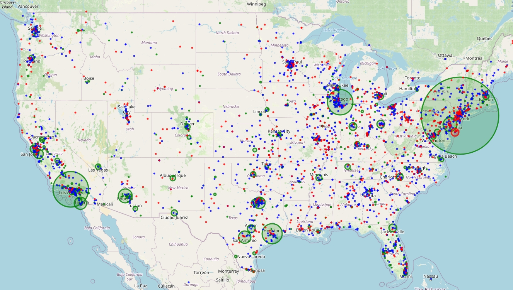

  <h1> Unfolding the Globe: A Map Project </h1>
  
  <h3>  Folium package to interactive maps hotter than a volcano, showing off US cities and states with pop that pops!</h3>
  
  

## :star2: About The Project
Showing the following graphs with tooltips and interactive zooming:
- **Volcanoes**: Shows markers for active volcanoes with information on their name and country.
    
- **Populous Cities**: Displays circles representing major cities, sized based on their population relative to the most populous city. Color indicates population ranking (green = high, blue = medium, red = low).
  
- **Populous States**: Uses a geojson file to outline states, colored based on their population ranking (green = high, blue = medium, red = low). A tooltip shows the state name and population.
  

## 👾 Built With
- ![python]
- ![pandas]
- ![folium]

[python]: 		https://img.shields.io/badge/Python-14354C?style=for-the-badge&logo=python&logoColor=white
[pandas]: https://img.shields.io/badge/pandas-%23150458.svg?style=for-the-badge&logo=pandas&logoColor=white
[folium]: https://img.shields.io/badge/folium-77B829.svg?style=for-the-badge&logo=folium&logoColor=white
